# FPGA Mel-frequency cepstrum

Development of a MFCC core in a FPGA

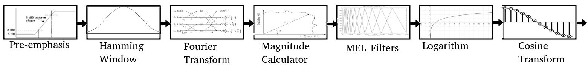

## Overview

In sound processing, the mel-frequency cepstrum (MFC) is a representation of the short-term power spectrum of a sound, based on a linear cosine transform of a log power spectrum on a nonlinear mel scale of frequency.

Mel-frequency cepstral coefficients (MFCCs) are coefficients that collectively make up an MFC. They are derived from a type of cepstral representation of the audio clip (a nonlinear "spectrum-of-a-spectrum"). The difference between the cepstrum and the mel-frequency cepstrum is that in the MFC, the frequency bands are equally spaced on the mel scale, which approximates the human auditory system's response more closely than the linearly-spaced frequency bands used in the normal spectrum. This frequency warping can allow for better representation of sound, for example, in audio compression.

For illustrating this documentation, we will use some pictures from the notebook available. Our original audio file would look like this.
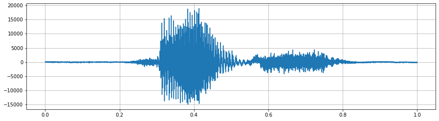

## Pre-Emphasis

The first step is to apply a pre-emphasis filter to the signal to amplify the high frequencies. A pre-emphasis filter is useful in several ways: 
 - To balance the frequency spectrum since high frequencies generally have smaller amplitudes compared to low frequencies. 
 - To avoid numerical problems during the Fourier transform operation, and (3) can also improve the signal-to-noise ratio (SNR).

The pre-emphasis filter can be applied to a signal x using the first-order filter in the following equation: 
y(t)=x(t)−αx(t−1)
The values for the filter coefficient (α) that we have chosen is: 1-1/32 = 0,96875 which is between the typical value of 0.95 to 0.97 and can be done easily with a shift register.
After pre-emphasis, we have our audio:
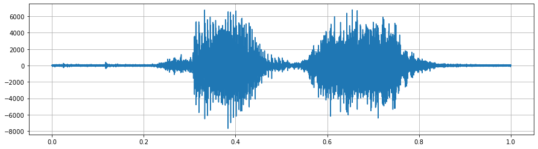

## Framing

After pre-emphasis, we need to split the signal into short-time frames. The rationale behind this step is that frequencies in a signal change over time, so in most cases it doesn’t make sense to do the Fourier transform across the entire signal in that we would lose the frequency contours of the signal over time. To avoid that, we can safely assume that frequencies in a signal are stationary over a very short period of time. Therefore, by doing a Fourier transform over this short-time frame, we can obtain a good approximation of the frequency contours of the signal by concatenating adjacent frames.
In our design, we have a window of 512 samples to which we add every time a third which is roughly 170 new samples.

As an example, a frame of the previous audio would look like this:
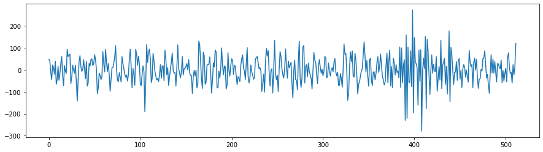

## Window
After slicing the signal into frames, we apply a window function such as the Hamming window to each frame. A Hamming window has the following form:
w[n]=0.54−0.46cos(2πnN−1)
where, 0≤n≤N−1, N is the window length. Plotting the previous equation yields the following plot:

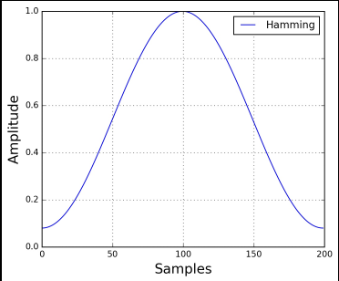

In order to construct such a waveform, we store only the first quarter of the window values because the curve can be reconstructed with symetries. also we discard half of the remaining values and reconstruct the missing ones with linear interpolation at runtime.

Once applied, we get our new waveform:

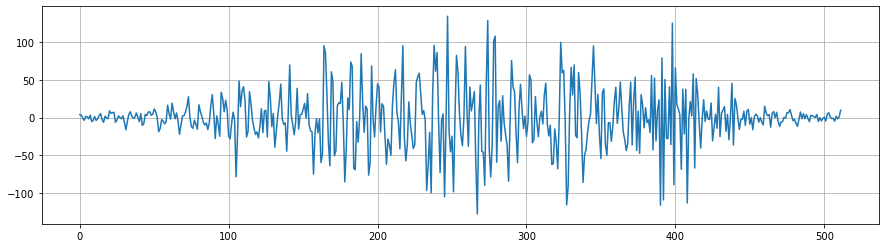

## Fourier-Transform

This is a Radix-2 division in time (DIT) block-FFT

Complex datasamples are first loaded into the memory, an FFT is performed on the data and computed FFT samples can then be read out. One pipelined butterfly computation core iterates over the data and computes one set of two new complex samples each clockcycle. The butterfly core contains the pipelined computation datapath, the twiddle memory, twiddle decoder and twiddle address calculator. Complex multiplication is implemented 3 DSPs and adders. The core is fully pipelined, ingesting two inputs and emitting two outputs at every clockcycle. The full pipeline length with registered ram output is 8 cycles. Writeback happens in the same cycle as the last computation. The Twiddle factors are basically just points on the unit circle. Due to symmetries a lot of the points can be generated from only 1/4th of the full circle. The twiddle decoder multiplexes the saved data to the right position for the requested twiddle factor. There are 3 banks of data-ram in total. ram1 always gets read and written in order, while ram2a and ram2b contain data in a shuffled order so that the butterfly core can always read its two inputs from different memory banks. Due to the pipeline delay in the computation, the second ram needs to be double buffered so that data of the current fft stage doesn't get overwritten (in ram1 the data overwritten is always expendable).

Once our windowed frame goes through our FFT, we get our complex output. (only I represented here)
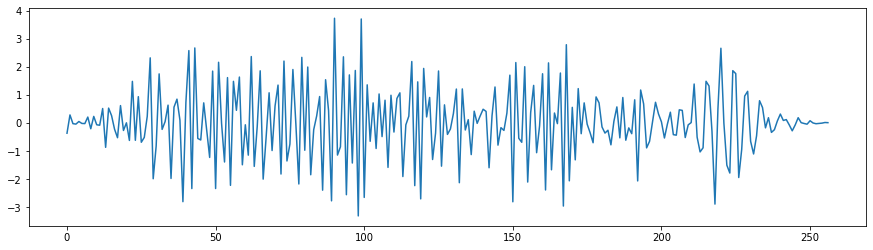

## Power Spectrum

The Power Spectruc implemented here uses 2 multiplicated to elevate each of the I and Q value out of the FFT into it's square. then add both of them together. A scaling can be done here.
Here is a view
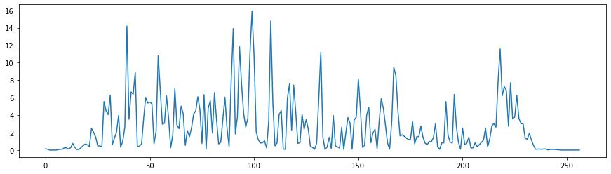

## Filter Banks
The final step to computing filter banks is applying triangular filters, typically 32 filters, nfilt = 32 on a Mel-scale to the power spectrum to extract frequency bands. The Mel-scale aims to mimic the non-linear human ear perception of sound, by being more discriminative at lower frequencies and less discriminative at higher frequencies. We can convert between Hertz (f) and Mel (m) using the following equations:

m=2595log10(1+f700)
f=700(10m/2595−1)
Each filter in the filter bank is triangular having a response of 1 at the center frequency and decrease linearly towards 0 till it reaches the center frequencies of the two adjacent filters where the response is 0, as shown in this figure:
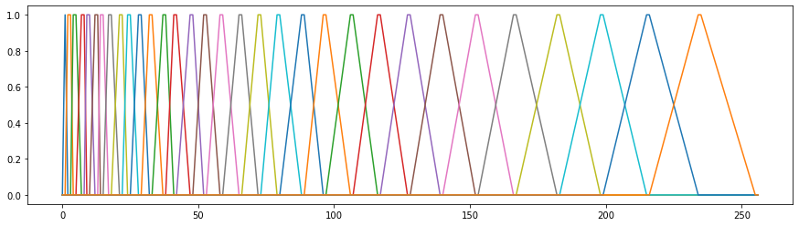

Our Filterbank uses a single multiplier for the entire design with a single pass. It is implemented using 2 registers. Ascendant and Descendant. as in any place in time, 2 segments are crossing eachother and their sum at the same absis is equal to 1. It is therefore possible to calculate on one go the entire filterbank.

The output of our powerspectrum applied to the filterbank is represented here.
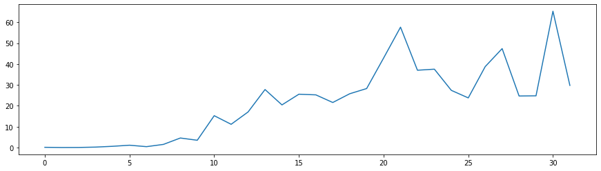

## Logarithm

The logarithm is an implementation of a fix point base 2 using Clay. S. Turner's method presented in this paper: https://stm32duinoforum.com/forum/dsp/BinaryLogarithm.pdf
The module uses a single multiplier and a couple of shift registe.
Contrary to the classical MFCC algorithm, we keep it on a base2 which is proportionnal to the base10 log

The output is represented here
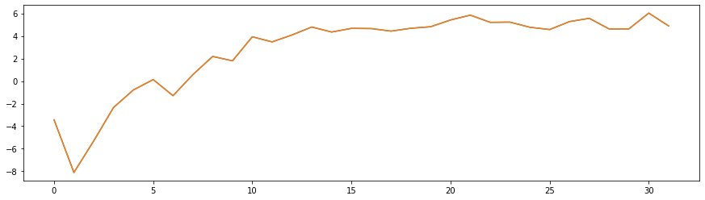

## Discret Cosine Transform

In order to decorelate the output of our log filterbank, a DCT is used. Our implementation is a Type 2 DCT using 4N FFT and no shifts.
Signal [a, b, c, d] becomes

[0, a, 0, b, 0,  c,  0,  d,  0,  d,  0,  c, 0, b, 0, a].

Then take the FFT to get the spectrum

[A, B, C, D, 0, -D, -C, -B, -A, -B, -C, -D, 0, D, C, B]

then throw away everything but the first [A, B, C, D], and we're done:

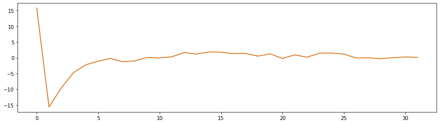

## Final Output
By doing that process on 93 frames, we have 1sec of sound. each of the vertical line being 32 spectrum (outpuf of DCT) we have our final result represented here.
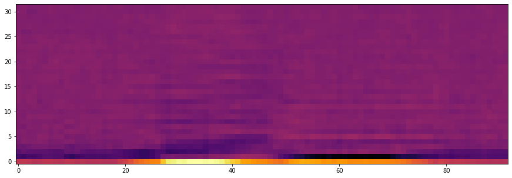

